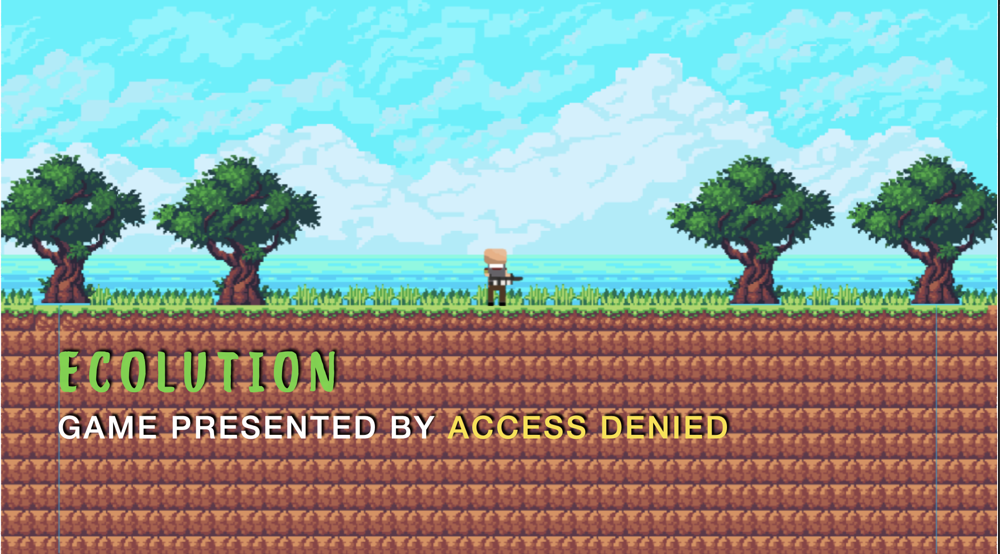
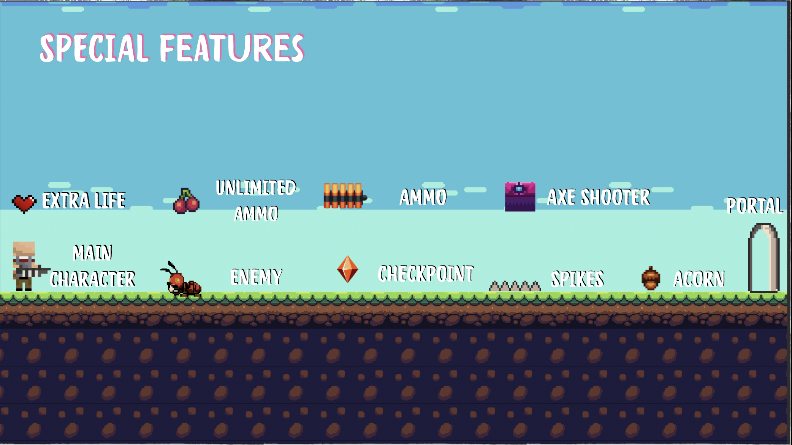
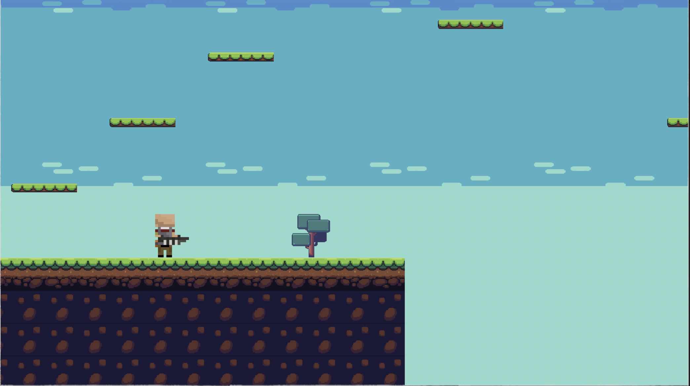
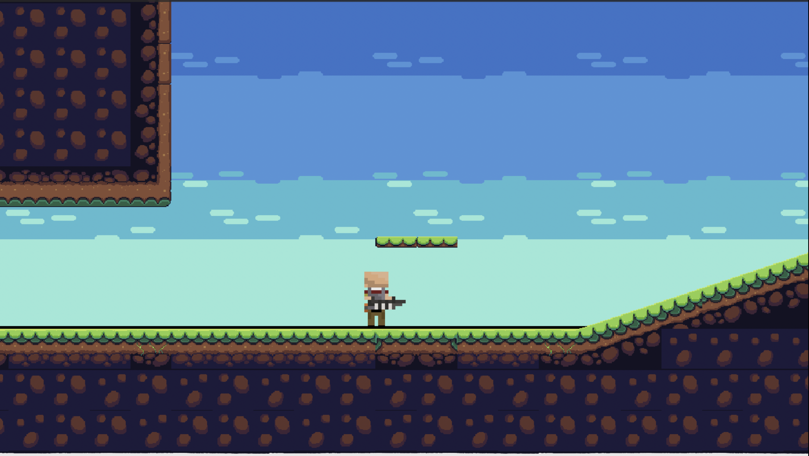

# Ecolution

A nature loving man faces many challenges in his way to make the earth, green once more.

## Download

Download the game for Mac OS X [here](Ecolution.app).

## Why did we build this game?

We built this game for the GIIS Hackathon 2K20, a competition to make a game using Unity and C# on the topic "Environmental Sustainability".

## Team Members

Name | Role
-- | ----
Sachin | Main Coder
Kumar | Level Designer
Pranay | Animator & Logo Designer
Bharat | Designer and Animator

## About The Game

Our game revolves around the idea of environmental sustainability where a nature loving man faces many challenges in his way to make the earth, green once more. 

## Objective

The main objective of our game is to promote the idea of environmental sustainability to youth by the medium of games and entertainment. We believe that this will have a direct impact on them and their mindset towards our surroundings. it will give birth to the idea of afforestation and care for our environment in their minds.

## Features

## What's next

We are looking to expand Ecolution to mobile platforms, such as IOS and Android, with touch control and get it on their respective app stores. Furthermore, we want to make this open source and available to download on the web for the public to play.

## Screenshots

